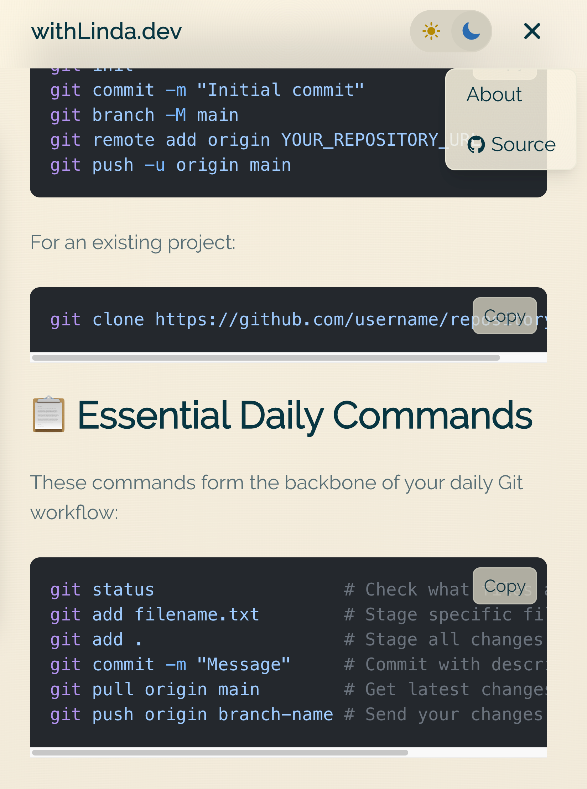
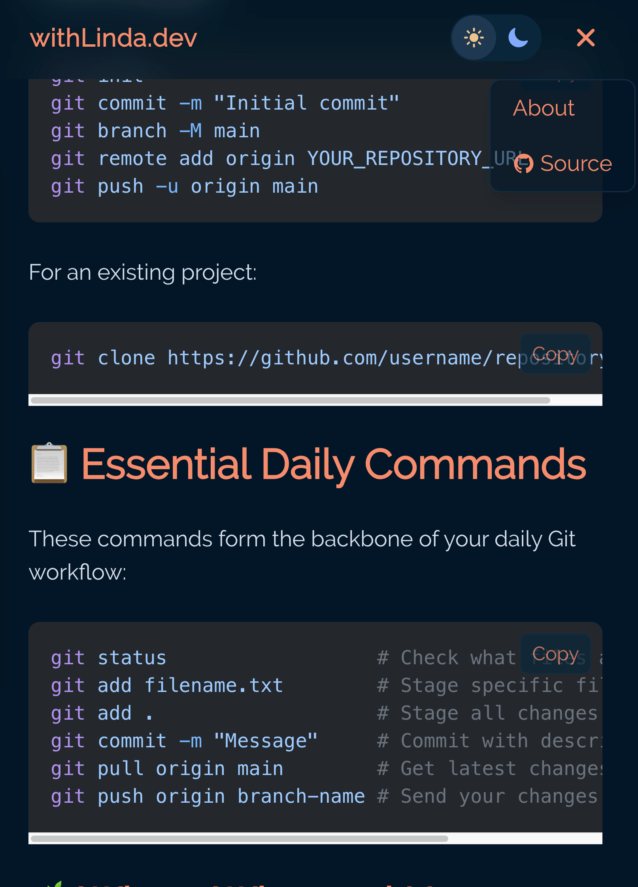

# withLinda.dev 🌲

A modern, performant personal blog built with Astro v5.0, featuring the elegant Everforest color theme, responsive design, and a sophisticated content management system.


## 🌟 What's Inside

This repository contains a fully-featured blog platform with:

- **Modern Stack**: Astro 5.0 SSG with selective React hydration for optimal performance
- **Beautiful Themes**: Custom Everforest theme with smooth light/dark mode transitions
- **Content Management**: Organized blog posts with categories and automatic routing
- **Developer Experience**: TypeScript, hot reload, and comprehensive error handling
- **Performance**: Static generation, optimized assets, and minimal JavaScript

## 🖼️ Screenshots

| Light Mode (Everforest Light) | Dark Mode (Everforest Dark) |
|:---:|:---:|
|  |  |

## 🚀 Quick Start

### Prerequisites

- **Node.js 18+** (check with `node --version`)
- **npm or yarn** (npm comes with Node.js)
- **Git** (for cloning the repository)

### Installation

```bash
# Clone the repository
git clone https://github.com/withLinda/withLinda.dev.git
cd withLinda.dev

# Install dependencies
npm install

# Start development server
npm run dev

# Open http://localhost:4321 in your browser
```

### Essential Commands

| Command | Description |
|---------|-------------|
| `npm run dev` | Start development server at http://localhost:4321 |
| `npm run build` | Build for production (includes type checking) |
| `npm run preview` | Preview production build locally |
| `npm run astro sync` | Sync content types (run after adding new content) |
| `npm run astro check` | Type check all TypeScript files |

## 📝 Creating Blog Posts

### Step-by-Step Guide

1. **Choose a category folder** in `src/content/blog/`:
   ```
   src/content/blog/
   ├── Love-the-storm-that-taught-you-to-build-better-shelters/
   ├── Mastery-sleeps-in-fragments-until-curiosity-fuses-them-awake/
   └── a-powerful-river-cant-be-dammed-only-redirected/
   ```

2. **Create a new `.md` file** with a descriptive filename (becomes the URL):
   ```bash
   # Example: creating a new post about TypeScript
   touch src/content/blog/mastery/typescript-tips-2025.md
   ```

3. **Add frontmatter and content**:
   ```markdown
   ---
   title: "Essential TypeScript Tips for 2025"
   description: "Modern TypeScript patterns and best practices"
   pubDate: 2025-01-22
   tags: ["typescript", "programming", "web-dev"]
   author: "Linda"
   ---

   # Essential TypeScript Tips for 2025

   Your content here...

   ## Code Examples

   ```typescript
   // Code blocks are automatically highlighted
   const greeting: string = "Hello, World!";
   ```
   ```

4. **Sync content types** (required for new posts):
   ```bash
   npm run astro sync
   ```

5. **View your post** at `http://localhost:4321/blog/[category]/[filename]`

### Frontmatter Reference

#### Required Fields
```yaml
---
title: "Your Post Title"        # Displayed as heading
description: "Brief summary"    # Used for SEO and previews
pubDate: 2025-01-22             # Publication date (YYYY-MM-DD)
---
```

#### Optional Fields
```yaml
---
updatedDate: 2025-01-23         # Last update date
tags: ["astro", "web-dev"]      # Post tags (array)
author: "Linda"                 # Author name
---
```

### Creating New Categories

1. **Create a new folder** in `src/content/blog/` with a URL-safe name:
   ```bash
   mkdir src/content/blog/your-new-category
   ```

2. **Add the display name** in `src/config.ts`:
   ```typescript
   export const CATEGORY_NAMES: Record<string, string> = {
     'your-new-category': 'Your New Category Display Name',
     // ... existing categories
   }
   ```

3. **Add posts** to the new category folder

## 🎨 Theme System

### Understanding the Everforest Theme

The site uses a sophisticated color system based on the Everforest palette:

```
src/styles/
├── global.css                    # Main entry point
└── themes/
    ├── everforest-base.css      # Color definitions
    ├── everforest-light.css     # Light mode overrides
    ├── everforest-dark.css      # Dark mode overrides
    ├── body-backgrounds.css     # Background patterns & orbs
    ├── layout-backgrounds.css   # Layout-specific styles
    └── post-cards.css           # Blog card styles
```

### Customizing Colors

1. **Light mode adjustments**: Edit `src/styles/themes/everforest-light.css`
2. **Dark mode adjustments**: Edit `src/styles/themes/everforest-dark.css`
3. **Base colors**: Modify `src/styles/themes/everforest-base.css`

### Using Theme Colors in Components

```jsx
// Use semantic color variables in Tailwind classes
<div className="bg-everforest-bg text-everforest-fg">
  <h1 className="text-everforest-yellow">Title</h1>
  <p className="text-everforest-text">Content</p>
</div>
```

## 🏗️ Architecture Overview

### Technology Stack

- **Framework**: [Astro 5.13](https://astro.build) - Static Site Generator
- **UI Components**: [React 18.3](https://react.dev) - For interactive components
- **Styling**: [Tailwind CSS v4.1](https://tailwindcss.com) - Utility-first CSS
- **Language**: [TypeScript 5.6](https://www.typescriptlang.org) - Type safety
- **Syntax Highlighting**: [Shiki](https://shiki.matsu.io) - Beautiful code blocks
- **Icons**: [React Icons](https://react-icons.github.io) - Icon library

### Project Structure

```
withLinda.dev/
├── src/
│   ├── components/              # UI components
│   │   ├── *.astro             # Static components (SSG)
│   │   └── *.tsx               # Interactive React components
│   ├── content/
│   │   └── blog/               # Blog posts (organized by category)
│   ├── layouts/
│   │   └── BlogPost.astro     # Blog post template
│   ├── pages/
│   │   ├── index.astro        # Homepage
│   │   ├── about.md           # About page (Markdown)
│   │   └── blog/
│   │       └── [...id].astro  # Dynamic blog routes
│   ├── styles/                 # Global styles and themes
│   ├── utils/                  # Utility functions
│   ├── config.ts              # Site configuration
│   └── content.config.ts      # Content schema (Zod validation)
├── public/                     # Static assets
├── astro.config.mjs           # Astro configuration
├── tsconfig.json              # TypeScript configuration
├── postcss.config.js          # PostCSS for Tailwind v4
└── package.json               # Dependencies
```

### Component Architecture

#### Static Components (`.astro`)
Server-rendered at build time, no client JavaScript:
- `BaseHead` - Meta tags and SEO
- `Header` - Navigation bar
- `Footer` - Site footer
- `Body` - Layout wrapper with animations
- `Content` - Main content container

#### Interactive Components (`.tsx`)
Hydrated on the client for interactivity:
- `ThemeToggleButton` - Light/dark mode switcher
- `MobileMenu` - Responsive navigation
- `CopyCodeButton` - Code block copy functionality

#### Hydration Strategies
```astro
<!-- Load immediately (critical UI) -->
<ThemeToggleButton client:load />

<!-- Load when visible (below fold) -->
<MobileMenu client:visible />

<!-- Load when browser is idle -->
<CopyCodeButton client:idle />
```

## 🚢 Deployment

### Build for Production

```bash
# Type check and build
npm run build

# Preview production build locally
npm run preview
```

The build output is in the `dist/` folder, ready for deployment.

### Deployment Options

#### Vercel (Recommended)
```bash
# Install Vercel CLI
npm i -g vercel

# Deploy
vercel --prod
```

#### Netlify
1. Push to GitHub
2. Connect repository to Netlify
3. Build command: `npm run build`
4. Publish directory: `dist`

#### GitHub Pages
```bash
# Add to package.json scripts
"deploy": "npm run build && gh-pages -d dist"

# Deploy
npm run deploy
```

### Environment Variables

Create a `.env` file for local development:
```env
# Site URL (optional, for sitemap)
PUBLIC_SITE_URL=https://withlinda.dev
```

## 🛠️ Development Workflow

### Local Development

1. **Start dev server**: `npm run dev`
2. **Make changes**: Edit files, see live updates
3. **Add content**: Create posts, run `npm run astro sync`
4. **Type check**: `npm run astro check`
5. **Build**: `npm run build`

### Common Tasks

#### Adding a New Component
```bash
# Static component
touch src/components/MyComponent.astro

# Interactive component
touch src/components/MyComponent.tsx
```

#### Modifying Styles
1. Theme colors: Edit files in `src/styles/themes/`
2. Global utilities: Add to `src/styles/global.css`
3. Component styles: Use Tailwind classes

#### Updating Dependencies
```bash
# Check for updates
npm outdated

# Update all dependencies
npm update

# Update specific package
npm install package-name@latest
```

## 🐛 Troubleshooting

### Content Not Appearing
- Run `npm run astro sync` after adding new content
- Check frontmatter is valid YAML
- Ensure file has `.md` or `.mdx` extension

### Styles Not Working
- Tailwind v4 uses `@import 'tailwindcss'` (not `@tailwind`)
- Restart dev server if hot reload fails
- Check color variable names match Everforest system

### Build Errors
```bash
# Type check
npm run astro check

# Clean install
rm -rf node_modules package-lock.json
npm install
```

### Component Not Interactive
- Must be `.tsx` file (not `.astro`)
- Needs client directive (`client:load`, etc.)
- Check browser console for errors

## 📚 Resources

### Documentation
- [Astro Docs](https://docs.astro.build)
- [Tailwind CSS v4](https://tailwindcss.com/docs)
- [React Documentation](https://react.dev)
- [TypeScript Handbook](https://www.typescriptlang.org/docs/)

### Theme Reference
- [Everforest Color Scheme](https://github.com/sainnhe/everforest)
- Color palette available in `src/styles/themes/everforest-base.css`

### Community
- [Astro Discord](https://astro.build/chat)
- [GitHub Issues](https://github.com/withLinda/withLinda.dev/issues)

## 📄 License

This project is open source and available under the [MIT License](LICENSE).

## 🤝 Contributing

Contributions, issues, and feature requests are welcome! Feel free to check the [issues page](https://github.com/withLinda/withLinda.dev/issues).

### How to Contribute

1. Fork the repository
2. Create your feature branch (`git checkout -b feature/AmazingFeature`)
3. Commit your changes (`git commit -m 'Add some AmazingFeature'`)
4. Push to the branch (`git push origin feature/AmazingFeature`)
5. Open a Pull Request

---

Built with ❤️ using [Astro](https://astro.build) • Styled with [Tailwind CSS](https://tailwindcss.com) • Themed with [Everforest](https://github.com/sainnhe/everforest)
